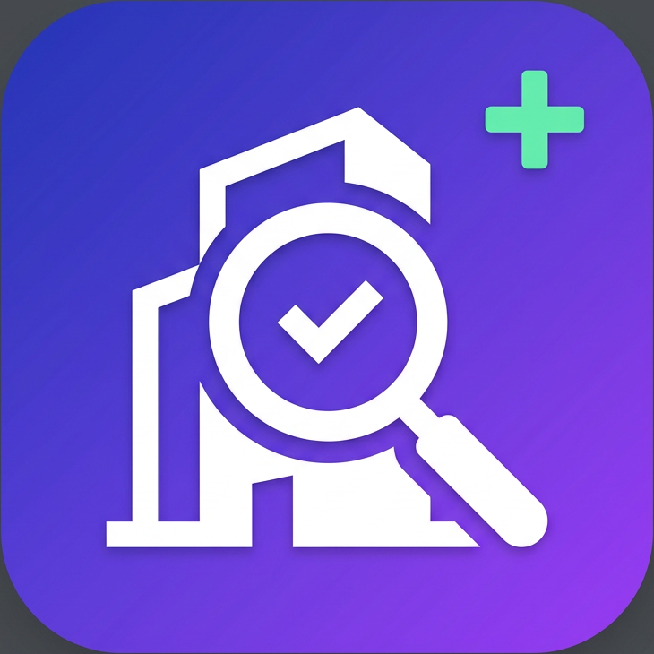

#  ConsultaCNPJ+

Frontend React moderno para consulta de CNPJ na API pública
[publica.cnpj.ws](https://publica.cnpj.ws/cnpj/{cnpj}) (dados públicos da Receita Federal).

## ▶️ Como rodar

```bash
npm install
npm run dev      # abre em http://localhost:5173
```

Build de produção: `npm run build` (saída em `dist/`) e `npm run preview` para servir o build.

## ✨ Funcionalidades

- **Campo de CNPJ com máscara automática** (`00.000.000/0000-00`) enquanto digita,
  com validação dos **dígitos verificadores** antes de chamar a API.
- **Botão Consultar** com estado de **loading** (spinner no botão + skeleton animado).
- **Tratamento de erros**: CNPJ inexistente (404), limite de 3 consultas/minuto (429),
  falha de rede/CORS e respostas inválidas — cada caso com mensagem amigável.
- **Resumo visual** do CNPJ: razão social, nome fantasia, situação cadastral (com cor),
  matriz/filial, porte, Simples/MEI, capital social, endereço (com link p/ mapa),
  cidade/UF, CNAE principal, telefones, e-mail e **inscrições estaduais** com status.
- **Seção dinâmica "Todos os dados retornados"**: renderiza automaticamente TODO o
  JSON da API recursivamente — objetos, listas, listas de objetos (tabela quando as
  colunas são simples, cartões quando há objetos aninhados), com seções retráteis.
- **Contador de campos preenchidos** (`X de Y · Z% de completude`) com barra de progresso.
- **JSON bruto**: visualização com syntax highlight, botão copiar (com feedback) e tamanho.
- **Impressão/PDF**: botão flutuante e folha `@media print` dedicada (relatório A4 limpo,
  com cabeçalho de emissão, seções expandidas e sem elementos de tela).
- **Formatação automática**: CNPJ, CPF, CEP, telefone, datas ISO (`dd/mm/aaaa`),
  booleanos (Sim/Não com badge) e capital social (R$).
- **Layout profissional e responsivo** (mobile-first), sem biblioteca de ícones —
  todos os ícones são SVG inline próprios.
- Chamada direta ao navegador (a API libera CORS) com **fallback automático** para o
  proxy do Vite (`/api/cnpj`) caso a rede/CORS bloqueie.
- **ErrorBoundary + rede de segurança no HTML**: erros nunca deixam a página em branco.

## 🗂 Estrutura

```
src/
├── App.jsx                    # Orquestra busca, estados, layout e rodapé/créditos
├── index.css                  # Tailwind + animações + @media print
├── lib/
│   ├── api.js                 # fetch com fallback (direta → proxy) e erros tipados
│   └── format.js              # máscaras, validação, formatação, labels, contagem
└── components/
    ├── Icons.jsx              # ícones SVG inline (sem lib externa)
    ├── States.jsx             # formulário de busca, skeleton, erro, estado vazio
    ├── SummaryCard.jsx        # resumo visual do CNPJ
    ├── DynamicJson.jsx        # renderizador recursivo de TODO o JSON
    └── RawJson.jsx            # JSON bruto + copiar
```

## 🖨️ Impressão / PDF

- Botão flutuante **“Imprimir / PDF”** (canto inferior direito) abre a impressão do navegador.
- Folha de estilos `@media print` dedicada: relatório limpo em **A4** — cabeçalho com logo,
  nome do sistema e data/hora de emissão; formulário, botões, rodapé e JSON bruto ocultos;
  **todas as seções expansíveis saem abertas**; fundos escuros convertidos para branco;
  tiles e linhas de tabela sem quebras de página.

## 👤 Créditos do desenvolvedor (e aspectos legais/LGPD)

**Desenvolvido por Danillo Coutinho** · ✉️ danilloc@uol.com.br ·
🐙 [github.com/danillocoutinhobomfim](https://github.com/danillocoutinhobomfim)

Os créditos aparecem no rodapé do sistema e são definidos no objeto `DEVELOPER`
no início de `src/App.jsx` (nome, e-mail e GitHub).

Por que é seguro, em resumo (não substitui aconselhamento jurídico):

1. **Seus próprios dados** — publicar o próprio nome/contato é dado disponibilizado pelo
   próprio titular (LGPD, art. 7º, IV), base legal válida e usada no próprio sistema.
2. **Termos de uso da API** (cnpj.ws) — a API Pública é gratuita (3 consultas/min/IP) e
   permite uso; o dado retornado deve ser para **benefício próprio do usuário**, sendo
   **proibida a revenda/comercialização dos dados**. Este sistema apenas consulta e exibe,
   sem armazenar — dentro das regras. Mantemos a **atribuição da fonte** no rodapé.
3. **LGPD sobre os dados exibidos** — o cartão CNPJ é público por lei (Receita Federal),
   incluindo o quadro societário; o sistema **não armazena, não cria perfil e não repassa**
   dados (privacidade by default). Recomenda-se não implementar exportação em massa.
4. **Boas práticas já embutidas** — rodapé informa a fonte, os termos e declara que o
   sistema é **independente, sem vínculo com a Receita Federal ou com o CNPJ.ws**,
   evitando qualquer indução de endosso oficial.

## 🚀 Publicação (GitHub + Render)

> Repositório: **[danillocoutinhobomfim/ConsultaCNPJmais](https://github.com/danillocoutinhobomfim/ConsultaCNPJmais)**
> URL final no Render: **https://consultacnpjmais.onrender.com**

### 0. Prepare a pasta para envio

Use o conteúdo do `consulta-cnpj.zip` extraído. O que vai para o GitHub é o
**conteúdo da pasta `cnpj-app`** (o `package.json` deve ficar na raiz do repositório).
**Não envie** `node_modules/` nem `dist/` (já estão bloqueados pelo `.gitignore`).

### 1. Atualizar o GitHub (o repositório já existe com arquivos)

**Opção A — pelo site (sem instalar nada):**
1. Abra [github.com/danillocoutinhobomfim/ConsultaCNPJmais](https://github.com/danillocoutinhobomfim/ConsultaCNPJmais).
2. Clique em **Add file → Upload files**.
3. **Apague os arquivos antigos desatualizados** se a estrutura mudou (pode deletar tudo menos `README.md`, se quiser, e reenviar do zero — o histórico fica no commit).
4. Arraste **todo o conteúdo** da pasta do projeto (arquivos e subpastas `src/` e `public/`).
5. Em *Commit changes*, escreva a mensagem (ex.: `v1.2 — renome ConsultaCNPJ+, impressão e créditos`) e clique em **Commit changes**.

> ⚠️ O upload pelo site não envia pastas vazias e não apaga sozinho o que sobrou —
> se preferir algo que sincroniza tudo automaticamente, use a Opção B ou C.

**Opção B — GitHub Desktop (mais prático no Windows):**
1. Instale o [GitHub Desktop](https://desktop.github.com) e faça login.
2. **File → Add local repository** → selecione a pasta do projeto (se ainda não for um repositório, ele oferece **Create a repository here** — confirme com o mesmo nome `ConsultaCNPJmais`).
3. Ele mostrará todas as diferenças. Escreva a mensagem do commit → **Commit to main**.
4. **Push origin** para enviar ao GitHub. Nas próximas atualizações, é só repetir commit + push.

**Opção C — Git pelo terminal (dentro da pasta do projeto):**
```bash
git init                                  # apenas se a pasta ainda não for um repo
git add .
git commit -m "v1.2 — renome ConsultaCNPJ+, impressão e créditos"
git branch -M main
git remote add origin https://github.com/danillocoutinhobomfim/ConsultaCNPJmais.git
git push -u origin main                   # pedirá login no navegador
```
*(Se der conflito porque o repo já tem arquivos, use `git pull origin main --allow-unrelated-histories` antes do push.)*

### 2. Publicar/atualizar no Render (grátis)

1. Acesse [render.com](https://render.com) → **Sign in with GitHub**.
2. **Novo site (primeira vez):** **New + → Static Site** → selecione o repositório `ConsultaCNPJmais` → confirme:
   - **Build command:** `npm install && npm run build`
   - **Publish directory:** `dist`
   - Clique em **Deploy** → o site sobe para `https://consultacnpjmais.onrender.com`.
3. **Site já criado:** não precisa fazer nada no Render — a cada `git push` (ou upload) no GitHub, o Render **recompila e publica sozinho** em alguns minutos. Acompanhe em **Events** no painel.

> O app funciona 100% no navegador: a chamada à API `publica.cnpj.ws` é direta do cliente
> (a API libera CORS), então **não há backend nem variáveis de ambiente** para configurar.

## ⚠️ Limites da API

A API pública permite **3 consultas por minuto por IP** (responde HTTP 429 além disso).
O app detecta o erro e orienta o usuário a aguardar. Fonte dos dados: Receita Federal
(via CNPJ.ws), com defasagem de até 45 dias conforme o Terms de Uso do provedor.
